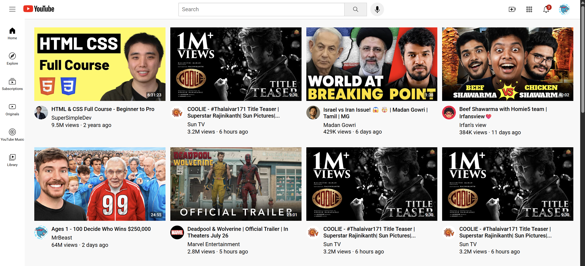
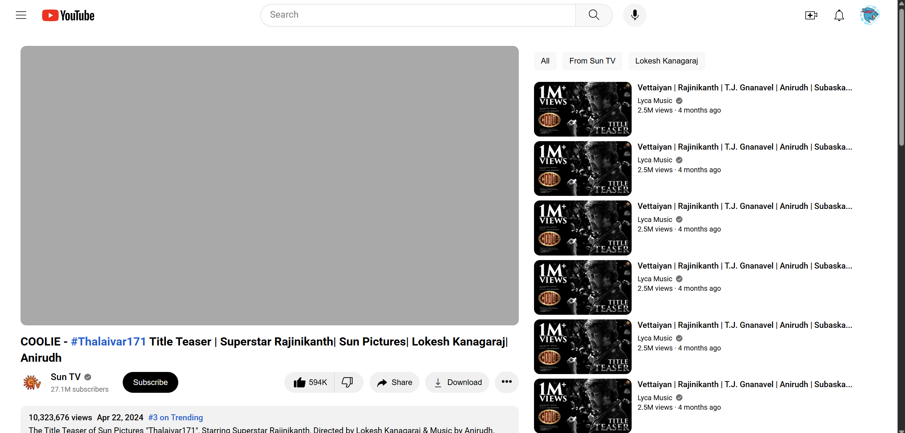

# YouTube Clone - My First HTML & CSS Project

This project is a recreation of the YouTube homepage and video streaming page, built using only HTML and CSS. It was my first major project after completing the HTML and CSS course from SuperSimpleDev, and it represents a significant milestone in my web development learning journey.

This was a part of the HTML and CSS course from the [SuperSimpleDev](https://youtu.be/G3e-cpL7ofc?si=HEj1uSi7vGZ9BbDM) YouTube channel.

## My Journey

I was always curious to learn HTML and CSS because I loved the process of recreating famous designs and the satisfaction of bringing designs to life through code. This project was born out of that curiosity.

Building the YouTube UI from scratch was a challenging yet incredibly rewarding experience. It was the first time I applied my knowledge of HTML and CSS to a real-world design, and seeing it come together was a moment of pure joy and accomplishment. This project solidified my understanding of fundamental web development concepts and fueled my passion for building beautiful and functional web interfaces.

## What's inside?

This repository contains the code for two main pages:

*   **YouTube Homepage:** A replica of the YouTube homepage layout, which you can find in the `yt-homepage/` directory.
*   **YouTube Video Page:** A replica of the video streaming page, located in the `yt-video-page/` directory.

## Screenshots

  
  

## Technologies Used

*   HTML5
*   CSS3

This project is a testament to what can be achieved with the foundational building blocks of the web. It was a fantastic learning experience, and I'm proud to share it as part of my coding journey. 